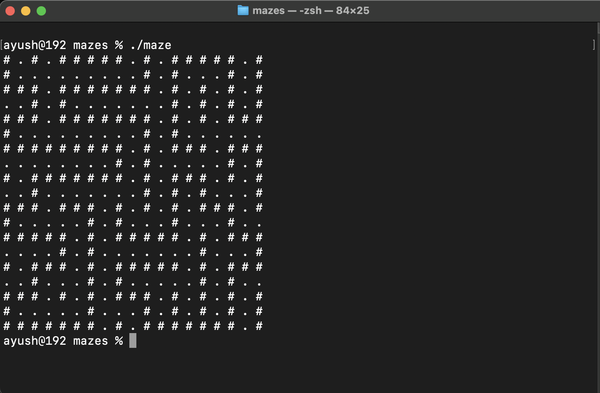

# Maze Generator

This is an implementation of the Depth-First Search (DFS) algorithm using an iterative approach with a stack, which I used to generate perfect mazes.

This program generates a random perfect maze on each run. 

## Demo

  

